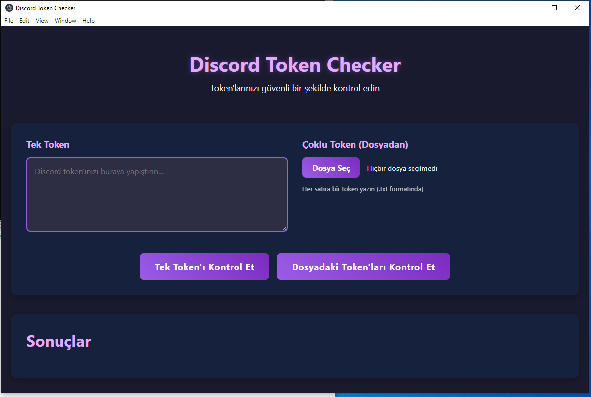
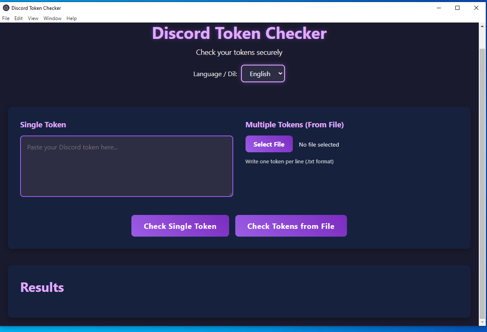

**Product Description:**

The application is desktop-based, as shown in the images. It is being released as open-source. Currently, it supports only Turkish, but English language support is coming soon – please follow for updates. The application is commercial (paid); for pricing and contact, feel free to reach out via Discord.

**It was built with Turkish architecture!**
----------------------------------------------
**installation command**
```
npm install
```
**then run this file**
```
start_app.bat
```


----------------------------------------------

**Application interface:**


<p>
  <b>
  Supported Languages:
  </b>
  
</p>



**My Discord account: souse.0**

[Discord server](https://discord.gg/7yHSkrMZfg)
